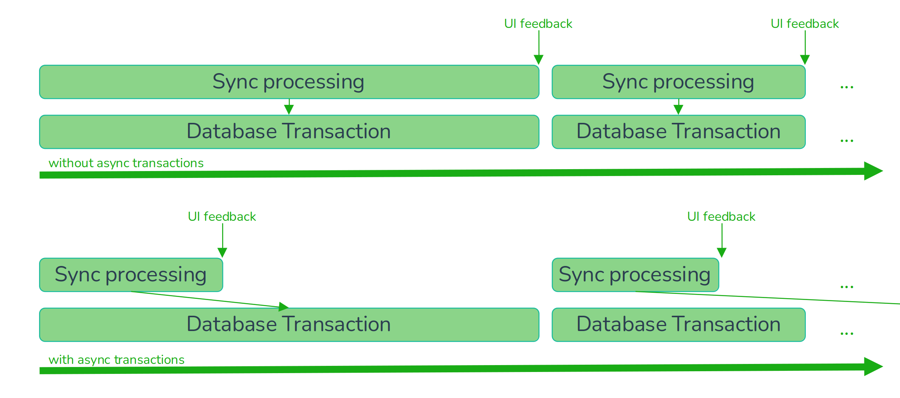

# Features

- [x] exchangeable database
    - in memory (e. g. for tests)
    - [trixnity-client-repository-exposed](https://gitlab.com/trixnity/trixnity/-/tree/main/trixnity-client/trixnity-client-repository-exposed)
      implements a database for trixnity-client with [Exposed](https://github.com/JetBrains/Exposed).
      This supports JVM based platforms only.
    - [trixnity-client-repository-realm](https://gitlab.com/trixnity/trixnity/-/tree/main/trixnity-client/trixnity-client-repository-realm)
      implements a database for trixnity-client with [realm](https://github.com/realm/realm-kotlin).
      This supports JVM/Android/Native.
    - [trixnity-client-repository-indexeddb](https://gitlab.com/trixnity/trixnity/-/tree/main/trixnity-client/trixnity-client-repository-indexeddb)
      implements a database for trixnity-client with [indexeddb](https://github.com/JuulLabs/indexeddb).
      This supports JS (browser).
    - [trixnity-client-repository-room](https://gitlab.com/trixnity/trixnity/-/tree/main/trixnity-client/trixnity-client-repository-room)
      implements a database for trixnity-client
      with [room](https://developer.android.com/jetpack/androidx/releases/room).
      This supports Android.
- [x] extremely fast reactive cache on top of the database using async transactions
- [x] exchangeable media store
    - in memory (e. g. for tests)
    - [trixnity-client-media-okio](https://gitlab.com/trixnity/trixnity/-/tree/main/trixnity-client/trixnity-client-media-okio)
      implements a file system based media store with [okio](https://github.com/square/okio).
      This supports JVM/Android/Native/NodeJs.
    - [trixnity-client-media-indexeddb](https://gitlab.com/trixnity/trixnity/-/tree/main/trixnity-client/trixnity-client-media-indexeddb)
      implements a store with [indexeddb](https://github.com/JuulLabs/indexeddb).
      This supports JS (browser).
- [x] very fast sync processing because of async transactions, so Trixnity doesn't need to wait until all events are
  saved to the database
- [x] media support (thumbnail generation, offline "upload", huge files, etc.)
- [x] E2E (olm, megolm)
- [x] verification
- [x] cross signing
- [x] fallback keys
- [x] room key backup
- [x] room key requests (only between own verified devices and when key backup is disabled)
- [x] room list
- [x] timelines
- [x] room upgrades (invisible due to merged timelines and auto-join)
- [x] user and room display name calculation
- [x] asynchronous message sending without caring about E2E stuff or online status
- [x] redactions
- [x] relations:
    - [x] reply (without fallback)
    - [x] replace
    - [ ] thread (basic support, no separate timelines or client aggregations yet)
- [x] notifications
- [x] server discovery

## Cache

Because reactive UIs are really common, Trixnity wants to give the UI access to data in a reactive way.
There are only a few databases, that support listeners and this would limit support for multiple supported
databases. That's why an intermediate layer based on Kotlin Flows has been introduced. This intermediate layer reads
values directly from
a generic database layer and also writes changes to it. The values are kept in this layer as long as they are
subscribed. This means, that if someone else subscribes a value, he will immediately get the value without an additional
database call. This goes so far, that even if there are no subscribers anymore, the value is kept a bit longer in
this layer. If someone ask for the value (for example) 10 seconds later, there is – again - no database call needed.

## Async transactions

Before async transactions has been added to Trixnity, most time of a sync processing was wasted due to writing to the
database.

Async transactions means, that all changes to the database are collected and processed in the background.
So database operations are decoupled from the cache and the cache does not need to wait for each write.
This means that even if a sync has not been saved completely to the database, the UI can already render the processed
sync.

