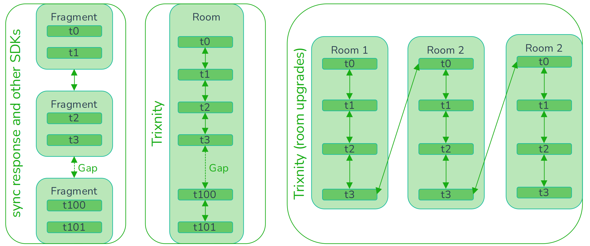

# Usage

## Read data

Most data in Trixnity is wrapped into Kotlins `Flow`. This means, that you
get the current value, but also every
future values. This is useful when e.g. the display name or the avatar of a user
changes, because you only need to
rerender that change and not your complete application.

There are some important data, which are described below:

### Rooms

To get the room list, call `matrixClient.room.getAll()`.
With `matrixClient.room.getById(...)` you can get one room.

### Users

To get all members of a room, call `matrixClient.user.getAll(...)`. Because room
members are loaded lazily, you should
also call `matrixClient.user.loadMembers(...)` as soon as you open a room.
With `matrixClient.user.getById(...)` you can
get one user.

### Timeline and TimelineEvents

The easiest way to compose a timeline is to call `matrixClient.room.getTimeline(...)`.

Normally a sync sends a fragment of the timeline to the client. There also can be gaps. Other clients save this almost
the same into the database, so with fragments pointing to each other.
In Trixnity there are no fragments. One `TimelineEvent` represent one event in a room timeline. Each `TimelineEvent`
points to the previous and next known event id and also saves, if there is a gap.
This allows Trixnity to benefit from Kotlin Flows, because a timeline is just a stream of
`TimelineEvent`s. So everytime a subscriber wants a new timeline event, the producer loads or fetches the next.

This way, it is also possible to connect upgraded rooms. That happens invisible from the developer. The timelines are
merged and the flow just gives you the next timeline event.



You can always get the last known `TimelineEvent` of a room with `matrixClient.room.getLastTimelineEvents(...)`.

The following example will always print the last 20 events of a room. Note, that
this doesn't have to be the best way to compose a timeline. It is just a nice
example.

```kotlin
matrixClient.room.getLastTimelineEvents(roomId)
    .toFlowList(MutableStateFlow(20)) // we always get max. 20 TimelineEvents
    .collectLatest { timelineEvents ->
        timelineEvents.forEach { timelineEvent ->
            val event = timelineEvent.first()?.event
            val content = timelineEvent.first()?.content?.getOrNull()
            val sender = event?.sender?.let {
                matrixClient.user.getById(it, roomId).first()?.name
            }
            when {
                content is RoomMessageEventContent -> println("${sender}: ${content.body}")
                content == null -> println("${sender}: not yet decrypted")
                event is MessageEvent -> println("${sender}: $event")
                event is StateEvent -> println("${sender}: $event")
                else -> {
                }
            }
        }
    }
```

### Outbox

Messages, that were sent with Trixnity can be accessed
with `matrixClient.room.getOutbox()` as long as they are not
received (also called "echo") from the matrix server.

## Other operations

Many operations can be done
with [trixnity-clientserverapi-client](https://gitlab.com/trixnity/trixnity/-/tree/main/trixnity-clientserverapi/trixnity-clientserverapi-client).
You have access to it
via `matrixClient.api`. There are also some high level operations, which are
managed by Trixnity. Some of them are
described below.

### Send messages

With `matrixClient.room.sendMessage(...)` you get access to an extensible DSL to
send messages. This messages will be
saved locally and sent as soon as you are online.

```kotlin
// send a text message
matrixClient.room.sendMessage(roomId) {
    text("Hi!")
}
// send an image
matrixClient.room.sendMessage(roomId) {
    image("dino.png", image, ContentType.Image.PNG)
}
```

### Media

To upload media there is `MediaService` (can be accessed
with `matrixClient.media`).

### Verification

To verify own and other devices there is `VerificationService` (can be accessed
with `matrixClient.verification`).

### Cross Signing

To bootstrap cross signing there is `KeyService` (can be accessed
with `matrixClient.key`).