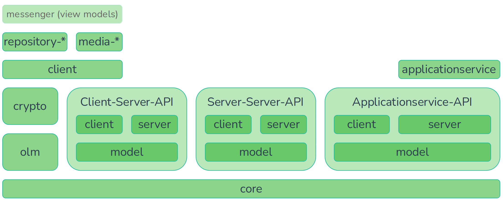

# Modules

This project contains among others the following modules, which can be used independently:

- [trixnity-core](https://gitlab.com/trixnity/trixnity/-/tree/main/trixnity-core)
  contains all basic data structures of the spec and it’s serialization algorithms. This includes events, identifiers
  and other things like CrossSigningKeys.
- [trixnity-olm](https://gitlab.com/trixnity/trixnity/-/tree/main/trixnity-olm)
  implements the wrappers of the
  E2E-olm-library [libolm](https://gitlab.matrix.org/matrix-org/olm) for Kotlin
  JVM/Android/JS/Native. It also ships the
  olm binaries for most Android, JVM and Native targets.
- [trixnity-crypto](https://gitlab.com/trixnity/trixnity/-/tree/main/trixnity-crypto)
  contains various cryptographic algorithms
  used in Matrix.
- [trixnity-api-client](https://gitlab.com/trixnity/trixnity/-/tree/main/trixnity-api-client)
  provides tools for api client
  modules.
- [trixnity-api-server](https://gitlab.com/trixnity/trixnity/-/tree/main/trixnity-api-server)
  provides tools for api server
  modules.
- [trixnity-clientserverapi-*](https://gitlab.com/trixnity/trixnity/-/tree/main/trixnity-clientserverapi)
  provides modules to
  use
  the [Client-Server API](https://spec.matrix.org/latest/client-server-api/).
    - [trixnity-clientserverapi-model](https://gitlab.com/trixnity/trixnity/-/tree/main/trixnity-clientserverapi/trixnity-clientserverapi-model)
      provides shared model
      classes.
    - [trixnity-clientserverapi-client](https://gitlab.com/trixnity/trixnity/-/tree/main/trixnity-clientserverapi/trixnity-clientserverapi-client)
      is the client
      implementation without logic.
    - [trixnity-clientserverapi-server](https://gitlab.com/trixnity/trixnity/-/tree/main/trixnity-clientserverapi/trixnity-clientserverapi-server)
      is the server
      implementation without logic.
- [trixnity-serverserverapi-*](https://gitlab.com/trixnity/trixnity/-/tree/main/trixnity-serverserverapi)
  provides modules to
  use
  the [Server-Server API](https://spec.matrix.org/latest/server-server-api/).
    - [trixnity-serverserverapi-model](https://gitlab.com/trixnity/trixnity/-/tree/main/trixnity-serverserverapi/trixnity-serverserverapi-model)
      provides shared model
      classes.
    - [trixnity-serverserverapi-client](https://gitlab.com/trixnity/trixnity/-/tree/main/trixnity-serverserverapi/trixnity-serverserverapi-client)
      is the client
      implementation without logic.
    - [trixnity-serverserverapi-server](https://gitlab.com/trixnity/trixnity/-/tree/main/trixnity-serverserverapi/trixnity-serverserverapi-server)
      is the server
      implementation without logic.
- [trixnity-applicationserviceapi-*](https://gitlab.com/trixnity/trixnity/-/tree/main/trixnity-applicationserviceapi)
  provides
  modules to use
  the [Application Service API](https://spec.matrix.org/latest/application-service-api/).
    - [trixnity-applicationserviceapi-model](https://gitlab.com/trixnity/trixnity/-/tree/main/trixnity-applicationserviceapi/trixnity-applicationserviceapi-model)
      provides shared model classes.
    - [trixnity-applicationserviceapi-server](https://gitlab.com/trixnity/trixnity/-/tree/main/trixnity-applicationserviceapi/trixnity-applicationserviceapi-server)
      is
      the server implementation without logic.
- [trixnity-client](https://gitlab.com/trixnity/trixnity/-/tree/main/trixnity-client)
  provides a high level client
  implementation. It allows you to easily implement
  clients by just rendering data from and passing user interactions to Trixnity.